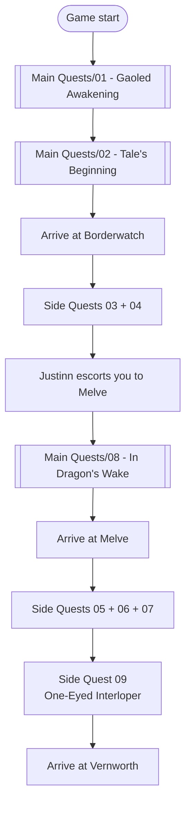

# Stage 1 — Awakening in Vermund

> *"You wake up in an underground cell. You escape with the help of a beastren. You travel across the wastes to the border military outpost, and set out toward the village of [[Locations/Melve]] — where the Dragon lies in wait."*

> [!summary] Stage Summary
> - **Main Quests**: 3 — in `Stage 1/Main Quests/`
> - **Side Quests**: 6 — in `Stage 1/Side Quests/`
> - **Progression**: Excavation Site → Ultramarine Waterfall → Borderwatch Outpost → Melve → Vernworth
> - **Estimated duration**: 2–4 hours

## 📍 Stage 1 Locations (progression order)

| # | Location | When to visit |
|---|---|---|
| 1 | [[Locations/Excavation Site]] | Start |
| 2 | [[Locations/Ultramarine Waterfall]] | After Excavation |
| 3 | [[Locations/Borderwatch Outpost]] | After Ultramarine |
| 4 | [[Locations/Melve]] | Last stop (Stage 1) |
| 5 | Melve → Vernworth road | During the transition |
| 6 | [[Vernworth]] | Start of Stage 2 |

---

## ⚔️ Main Quests

> 3 main quests. Located in `Stage 1/Main Quests/`.

| # | Quest | Location | Prerequisite |
|---|---|---|---|
| 1 | [[Main Quests/01 - Gaoled Awakening]] | Excavation Site ("The Hole") | — (intro) |
| 2 | [[Main Quests/02 - Tale's Beginning]] | Ultramarine Waterfall → Borderwatch | [[Main Quests/01 - Gaoled Awakening]] *(completed)* |
| 3 | [[Main Quests/08 - In Dragon's Wake]] | Borderwatch → Melve → road | [[Main Quests/02 - Tale's Beginning]] *(completed)* |

**Next main quest (Stage 2):** `Seat of the Sovran` — triggered on arrival at [[Vernworth]].

---

## 🗡️ Side Quests

> 6 side quests. Located in `Stage 1/Side Quests/`.

### Borderwatch Outpost (do before leaving for Melve)

| # | Quest | Prerequisite | Type |
|---|---|---|---|
| 1 | [[Side Quests/03 - Ordeal's of a New Recruit]] | [[Main Quests/02 - Tale's Beginning]] *(completed)* | ⏱️ Timed |
| 2 | [[Side Quests/04 - The Provisioner's Plight]] | [[Main Quests/02 - Tale's Beginning]] *(completed)* | 🌿 Foraging |

### Melve (triggered during [[Main Quests/08 - In Dragon's Wake]])

| # | Quest | Prerequisite | Type |
|---|---|---|---|
| 1 | [[Side Quests/05 - Medicament Predicament]] | [[Main Quests/08 - In Dragon's Wake]] *(started)* | 💊 Crafting |
| 2 | [[Side Quests/06 - Brother's Brave and Timid]] | [[Main Quests/08 - In Dragon's Wake]] *(started)* | 🛡️ Escort |
| 3 | [[Side Quests/07 - Nesting Troubles]] | [[Main Quests/08 - In Dragon's Wake]] *(started)* | 🔥 + ☠️ Fire/Poison |

### Melve → Vernworth road (auto-trigger)

| # | Quest | Prerequisite | Type |
|---|---|---|---|
| 1 | [[Side Quests/09 - One-Eyed Interloper]] | [[Main Quests/08 - In Dragon's Wake]] *(started)* | 🐉 Camouflaged Cyclops |

---

## 🗺️ Recommended Flow

## 📊 Checklist

### ⚔️ Main Quests
- [x] [[Main Quests/01 - Gaoled Awakening]]
- [x] [[Main Quests/02 - Tale's Beginning]]
- [ ] [[Main Quests/08 - In Dragon's Wake]]

### 🗡️ Borderwatch Side Quests
- [x] [[Side Quests/03 - Ordeal's of a New Recruit]]
- [x] [[Side Quests/04 - The Provisioner's Plight]]

### 🗡️ Melve Side Quests
- [x] [[Side Quests/05 - Medicament Predicament]]
- [x] [[Side Quests/06 - Brother's Brave and Timid]]
- [x] [[Side Quests/07 - Nesting Troubles]]

### 🗡️ Road Side Quest
- [ ] [[Side Quests/09 - One-Eyed Interloper]]

### 🗡️ Side Quests started on the Melve → Vernworth road (continue in Stage 2)
- [ ] [[Stage 2/Side Quests/34 - Claw Them Into Shape]] *(START / CONTINUE @ Moonglow Garden)*
- [ ] [[Stage 2/Side Quests/36 - Spellbound]] *(START @ Eini's House)*

## 🌉 Cross-Stage Prep (Stage 2 begins here)

> This section lists purchases to make during Stage 1. The cross-stage quests Claw (34) and Spellbound (36) start here — but they're tracked by the stub cards injected into the by-location/by-flow views (right after Brother's Brave) and only complete in Stage 2.

### Advanced purchases

- 🛒 **3 swords** at [[Locations/Borderwatch Outpost]] (Kassandra) — buy and **hand them directly to Beren** at [[Locations/Moonglow Garden]] during Stage 1 to open `Claw Them Into Shape`. ~850 G each.
- 📜 **Fulminous Shield** — buy from **Dudley in Melve** during Stage 1; grimoire is one of the 3 originals Trysha accepts in `Spellbound` (continuation in Stage 2).

## ⚠️ Critical Warnings

> [!warning] **Missable / Timed**
> 1. **Ordeal's of a New Recruit** — **time-limited** quest
> 2. **One-Eyed Interloper** — Cyclops can kill Gregor; his death = checkpoint blocked
> 3. **Borderwatch side quests** — they don't return after leaving the outpost

## 📚 Sources

All 9 quests were verified across 3 sources:

- [Fextralife Wiki DD2](https://dragonsdogma2.wiki.fextralife.com/)
- [IGN DD2 Guide](https://www.ign.com/wikis/dragons-dogma-2/)
- [Dragon's Dogma Wiki (Fandom)](https://dragonsdogma.fandom.com/)

#dragon's dogma #stage-1 #moc #vermund
