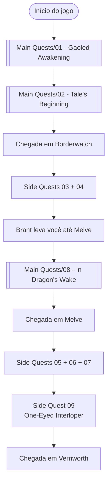

# Stage 1 — Awakening in Vermund

> *"Você desperta em uma cela subterrânea. Escapa com a ajuda de um beastren. Viaja pelo ermo até o posto militar de fronteira, e parte em direção à vila de [[Locations/Melve]] — onde o Dragão está à espreita."*

> [!summary] Resumo do Stage
> - **Main Quests**: 3 — em `Stage 1/Main Quests/`
> - **Side Quests**: 6 — em `Stage 1/Side Quests/`
> - **Progressão**: Excavation Site → Ultramarine Waterfall → Borderwatch Outpost → Melve → Vernworth
> - **Duração estimada**: 2–4 horas

## 📍 Locais do Stage 1 (ordem de progressão)

| # | Local | Quando visitar |
|---|---|---|
| 1 | [[Locations/Excavation Site]] | Início |
| 2 | [[Locations/Ultramarine Waterfall]] | Após Excavation |
| 3 | [[Locations/Borderwatch Outpost]] | Após Ultramarine |
| 4 | [[Locations/Melve]] | Por último (Stage 1) |
| 5 | Estrada Melve → Vernworth | Durante transição |
| 6 | [[Vernworth]] | Início do Stage 2 |

---

## ⚔️ Main Quests

> 3 quests principais. Estão em `Stage 1/Main Quests/`.

| # | Quest | Local | Pré-requisito |
|---|---|---|---|
| 1 | [[Main Quests/01 - Gaoled Awakening]] | Excavation Site ("The Hole") | — (intro) |
| 2 | [[Main Quests/02 - Tale's Beginning]] | Ultramarine Waterfall → Borderwatch | [[Main Quests/01 - Gaoled Awakening]] *(concluída)* |
| 3 | [[Main Quests/08 - In Dragon's Wake]] | Borderwatch → Melve → estrada | [[Main Quests/02 - Tale's Beginning]] *(concluída)* |

**Próxima main quest (Stage 2):** `Seat of the Sovran` — disparada ao chegar em [[Vernworth]].

---

## 🗡️ Side Quests

> 6 side quests. Estão em `Stage 1/Side Quests/`.

### Borderwatch Outpost (faça antes de partir para Melve)

| # | Quest | Pré-requisito | Tipo |
|---|---|---|---|
| 1 | [[Side Quests/03 - Ordeal's of a New Recruit]] | [[Main Quests/02 - Tale's Beginning]] *(concluída)* | ⏱️ Timed |
| 2 | [[Side Quests/04 - The Provisioner's Plight]] | [[Main Quests/02 - Tale's Beginning]] *(concluída)* | 🌿 Foraging |

### Melve (ativadas durante [[Main Quests/08 - In Dragon's Wake]])

| # | Quest | Pré-requisito | Tipo |
|---|---|---|---|
| 1 | [[Side Quests/05 - Medicament Predicament]] | [[Main Quests/08 - In Dragon's Wake]] *(iniciada)* | 💊 Crafting |
| 2 | [[Side Quests/06 - Brother's Brave and Timid]] | [[Main Quests/08 - In Dragon's Wake]] *(iniciada)* | 🛡️ Escort |
| 3 | [[Side Quests/07 - Nesting Troubles]] | [[Main Quests/08 - In Dragon's Wake]] *(iniciada)* | 🔥 + ☠️ Fire/Poison |

### Estrada Melve → Vernworth (trigger automático)

| # | Quest | Pré-requisito | Tipo |
|---|---|---|---|
| 1 | [[Side Quests/09 - One-Eyed Interloper]] | [[Main Quests/08 - In Dragon's Wake]] *(iniciada)* | 🐉 Cyclops Camuflado |

---

## 🎯 NPCs notáveis

| NPC | Onde | Papel |
|---|---|---|
| **Fiska** | Excavation Site | Overseer que acompanha você em Gaoled Awakening |
| **Rook** | Excavation Site | Acompanha a fuga |
| **The Pathfinder** (beastren) | Excavation Site | Liberta você da cela |
| **Medusa** (Gorgon) | Excavation Site | Mini-boss da primeira quest |
| **Brant** | Borderwatch / Melve / estrada | Capitão da Guarda |
| **Phill** | Borderwatch Outpost | Soldado portão sul — quest giver |
| **Geoffrey** | Borderwatch Outpost | Aprovisionador |
| **Kassandra** | Borderwatch Outpost | Merchant — compre 3 espadas aqui |
| **Ulrika** | Melve | Mulher que abriga o Arisen |
| **Gregor** | Estrada → Vernworth | Cavaleiro escolta — **deve sobreviver** |

## 🔑 Fatos verificados

1. **In Dragon's Wake**: 6.000 G + Troféu "Arisen" (bronze)
2. **Gaoled Awakening**: Arma inicial + Troféu "First Taste of Freedom" (bronze)
3. **Medicament**: 500 XP + 100 G + Ring of Exultation
4. **Brothers Brave**: 400 XP + 1.500 G + Homespun Cloak
5. **Gregor morrer** = bloqueia Northern Vermund Checkpoint
6. **Gold Trove Beetles** (Borderwatch → Melve): +0.15 carry capacity cada

## 🗺️ Fluxo Recomendado

## 📊 Checklist

### ⚔️ Main Quests
- [x] [[Main Quests/01 - Gaoled Awakening]]
- [x] [[Main Quests/02 - Tale's Beginning]]
- [ ] [[Main Quests/08 - In Dragon's Wake]]

### 🗡️ Side Quests de Borderwatch
- [x] [[Side Quests/03 - Ordeal's of a New Recruit]]
- [x] [[Side Quests/04 - The Provisioner's Plight]]

### 🗡️ Side Quests de Melve
- [x] [[Side Quests/05 - Medicament Predicament]]
- [x] [[Side Quests/06 - Brother's Brave and Timid]]
- [x] [[Side Quests/07 - Nesting Troubles]]

### 🗡️ Side Quest de Estrada
- [ ] [[Side Quests/09 - One-Eyed Interloper]]

### 🗡️ Side Quests iniciadas na estrada Melve → Vernworth (continuam em Stage 2)
- [ ] [[Stage 2/Side Quests/34 - Claw Them Into Shape]] *(INICIAR / CONTINUAR @ Moonglow Garden)*
- [ ] [[Stage 2/Side Quests/36 - Spellbound]] *(INICIAR @ Eini's House)*

## 🌉 Cross-Stage Prep (Stage 2 começa aqui)

> Esta seção lista prep de quests que **iniciam** em Stage 1 mas terminam em Stage 2. Marque as caixas no checklist acima conforme você joga; a continuação e a finalização acontecem no `Quests/Stage 2.md` `## 🎮 Ordem Recomendada de Execução`.

### Quests iniciadas na estrada Melve → Vernworth (completam em Stage 2)

- ⚔️ **`Claw Them Into Shape` (Stage 2, side quest #34)** *(INICIAR / CONTINUAR)* — na estrada Melve → Vernworth, vá para [[Locations/Moonglow Garden]] e fale com Beren; dê as 3 espadas compradas de [[Locations/Borderwatch Outpost]]/Kassandra. **COMPLETAR** acontece em Stage 2 pt.1 (fale com Beren no Borderwatch Training Grounds).
- 📖 **`Spellbound` (Stage 2, side quest #36)** *(INICIAR)* — norte de Moonglow Garden, em [[Locations/Eini's House]]; fale com Trhysa quando nenhum outro NPC estiver na casa. **CONTINUAR + COMPLETAR** acontecem em Stage 2 pt.2 (Trhysa — 3 grimórios ORIGINAIS; depois a casa da Trisha tem um rampage event — NÃO ataque, agarre quando ela parar).

### Compras antecipadas (evita quest locks)

- 🛒 **3 espadas** de [[Locations/Borderwatch Outpost]] (Kassandra) **antes** de sair de Stage 1 — sem elas, Claw Them Into Shape vira impossível de completar (Borderwatch não é revisitável). Preço: ~850 G cada.
- 📜 **Grimoires (Stage 2 quests #36 Spellbound + #43 The Sorcerer's Appraisal + #46 A Game of Wits)** — se quiser reservar originals cedo, `Let There Be Light` (Myrddin's Home upstairs), `Fulminous Shield` (Dudley em Melve), `Nation's Death Knell` (Ancient Battleground cenotaph — 2 originais no jogo), `Howling Blizzard` (Wendy em Nameless Village), `Towering Earth` (Waldhar no Gracious Hand's Vaults).

## ⚠️ Avisos Críticos

> [!warning] **Missable / Timed**
> 1. **Ordeal's of a New Recruit** — quest **com tempo limitado**
> 2. **One-Eyed Interloper** — ciclope pode matar Gregor; morte = checkpoint bloqueado
> 3. **Side quests de Borderwatch** — não voltam depois de sair do posto

> [!warning] **Stage 2 Preparation**
> Compre **3 espadas** com Kassandra em Borderwatch — você vai precisar em `Claw Them Into Shape` (Stage 2).

## 📚 Fontes

Todas as 9 quests foram verificadas em 3 fontes:

- [Fextralife Wiki DD2](https://dragonsdogma2.wiki.fextralife.com/)
- [IGN DD2 Guide](https://www.ign.com/wikis/dragons-dogma-2/)
- [Dragon's Dogma Wiki (Fandom)](https://dragonsdogma.fandom.com/)

#dragon's dogma #stage-1 #moc #vermund