# Stage 2 — Vernworth and Surroundings

> *"You arrive in Vernworth under Gregor's escort and are presented to Sovran Disa. The capital of Vermund becomes your hub — but political intrigues, oxcart escorts, hunts in Harve, training at Moonglow Garden, and pilgrimages to Sacred Arbor await before the crossing to Battahl."*

> [!summary] Stage Summary
> - **Main Quests**: 7 — in `Stage 2/Main Quests/`
> - **Side Quests**: 28 — in `Stage 2/Side Quests/`
> - **Progression**: Vernworth → Harve Village → Moonglow Garden → Eini's House → Harve (return) → Sacred Arbor → Checkpoint Rest Town → Vernworth (finale)
> - **Estimated duration**: 12–18 hours

## 📍 Stage 2 Locations (progression order)

| # | Location | When to visit |
|---|---|---|
| 1 | [[Locations/Vernworth]] | Arrival (Block 1) |
| 2 | [[Locations/Harve Village]] | After Block 1 (1st visit) |
| 3 | [[Locations/Vernworth]] | Return (Block 2) |
| 4 | [[Locations/Melve]] | Return (familiar questline) |
| 5 | [[Locations/Moonglow Garden]] | After Block 2 |
| 6 | [[Locations/Eini's House]] | After Moonglow |
| 7 | [[Locations/Harve Village]] | 2nd visit |
| 8 | [[Locations/Vernworth]] | Block 3 (archer chain) |
| 9 | [[Locations/Sacred Arbor]] | North of Vernworth |
| 10 | [[Locations/Checkpoint Rest Town]] | Road to Battahl |
| 11 | [[Locations/Vernworth]] | Block 4 (finale) |

---

## ⚔️ Main Quests

> 7 main quests. Located in `Stage 2/Main Quests/`.

| # | Quest | Location | Prerequisite |
|---|---|---|---|
| 15 | [[Main Quests/15 - Seat of the Sovran]] | Vernworth (gates/castle) | [[Main Quests/08 - In Dragon's Wake]] *(completed)* |
| 17 | [[Main Quests/17 - Monster Culling]] | Vernworth (outskirts) | [[Main Quests/15 - Seat of the Sovran]] *(started)* |
| 21 | [[Main Quests/21 - The Caged Magistrate]] | Vernworth (palace/Slums) | [[Main Quests/15 - Seat of the Sovran]] *(started)* |
| 23 | [[Main Quests/23 - The Stolen Throne]] | Vernworth | [[Main Quests/21 - The Caged Magistrate]] *(completed)* |
| 24 | [[Main Quests/24 - An Unsettling Encounter]] | Vernworth (Royal Quarter) | [[Side Quests/20 - Disa's Plot]] *(completed)* |
| 26 | [[Main Quests/26 - The Nameless Village]] | Vernworth | [[Main Quests/24 - An Unsettling Encounter]] *(completed)* |
| 44 | [[Main Quests/44 - Feast of Deception]] | Vernworth (finale) | [[Side Quests/43 - The Sorcerer's Appraisal]] *(completed)* |

**Next main quest (Stage 3):** `A Noble Exchange` — triggers upon arriving in Battahl.

---

## 🗡️ Side Quests

> 28 side quests. Located in `Stage 2/Side Quests/`.

### Block 1: Vernworth (arrival)

| # | Quest | Prerequisite | Type |
|---|---|---|---|
| 10 | [[Side Quests/10 - A Place to Call Home]] | [[Main Quests/08 - In Dragon's Wake]] *(completed)* | 🏠 Settling in |
| 11 | [[Side Quests/11 - The Ornate Box]] | [[Side Quests/10 - A Place to Call Home]] | 📦 Investigation |
| 12 | [[Side Quests/12 - Oxcart Courier]] | [[Main Quests/15 - Seat of the Sovran]] *(started)* | 🛤️ Escort |
| 13 | [[Side Quests/13 - The Heel of History]] | [[Side Quests/12 - Oxcart Courier]] *(completed)* | 📜 Lore / True ending |
| 14 | [[Side Quests/14 - The Gift of Giving]] | — | 🎁 Delivery |
| 16 | [[Side Quests/16 - Masked Correspondence]] | — | ✉️ Investigation |
| 19 | [[Side Quests/19 - Vocation Frustration]] | [[Side Quests/10 - A Place to Call Home]] | ⚔️ Vocation intro |
| 20 | [[Side Quests/20 - Disa's Plot]] | [[Main Quests/15 - Seat of the Sovran]] *(started)* | 🕵️ Political intrigue |
| 22 | [[Side Quests/22 - A Magesterial Amenity]] | — | 🍺 Service |
| 25 | [[Side Quests/25 - Every Rose Has Its Thorn]] | — | 🌹 Gathering |
| 27 | [[Side Quests/27 - The Arisen's Shadow]] | — | 🎭 Doppelganger |
| 28 | [[Side Quests/28 - Till Death Do Us Part]] | — | 💍 Romance |
| 29 | [[Side Quests/29 - A Beggar's Tale]] | — | 📖 Story / Investigation |
| 30 | [[Side Quests/30 - Saint of the Slums]] | — | ❤️ Charity |
| 31 | [[Side Quests/31 - House of the Blue Sunbright]] | [[Main Quests/15 - Seat of the Sovran]] *(completed)* | 🏛️ Noble intrigue |

### Harve Village (1st visit)

| # | Quest | Prerequisite | Type |
|---|---|---|---|
| 18 | [[Side Quests/18 - Scaly Invaders]] | [[Side Quests/10 - A Place to Call Home]] | 🦎 Coastal hunt |

### Melve (return)

| # | Quest | Prerequisite | Type |
|---|---|---|---|
| 32 | [[Side Quests/32 - Readvent of Calamity]] | [[Main Quests/15 - Seat of the Sovran]] *(completed)* | ⚠️ Calamity |
| 33 | [[Side Quests/33 - Home Is Where the Hearth Is]] | [[Main Quests/15 - Seat of the Sovran]] *(completed)* | 🏠 Reconstruction |

### Moonglow Garden

| # | Quest | Prerequisite | Type |
|---|---|---|---|
| 34 | [[Side Quests/34 - Claw Them Into Shape]] | [[Main Quests/15 - Seat of the Sovran]] *(completed)* + **3 swords from Stage 1** | 🗡️ Weapon shaping |
| 35 | [[Side Quests/35 - Beren's Final Lesson]] | [[Side Quests/34 - Claw Them Into Shape]] *(completed)* | 🏹 Final training |

### Eini's House

| # | Quest | Prerequisite | Type |
|---|---|---|---|
| 36 | [[Side Quests/36 - Spellbound]] | [[Side Quests/35 - Beren's Final Lesson]] *(completed)* | 📖 Magic study |

### Harve Village (2nd visit)

| # | Quest | Prerequisite | Type |
|---|---|---|---|
| 37 | [[Side Quests/37 - Trouble on the Cape]] | [[Side Quests/36 - Spellbound]] *(completed)* | ⚓ Coastal incident |

### Vernworth Block 3 (archer chain)

| # | Quest | Prerequisite | Type |
|---|---|---|---|
| 38 | [[Side Quests/38 - Gift of the Bow]] | [[Side Quests/37 - Trouble on the Cape]] *(completed)* | 🎁 Bow gift |
| 39 | [[Side Quests/39 - A Trial of Archery]] | [[Side Quests/38 - Gift of the Bow]] *(completed)* | 🏹 Trial |

### Sacred Arbor

| # | Quest | Prerequisite | Type |
|---|---|---|---|
| 40 | [[Side Quests/40 - The Ailing Arborheart]] | [[Side Quests/39 - A Trial of Archery]] *(completed)* | 🌳 Treant heal |

### Checkpoint Rest Town

| # | Quest | Prerequisite | Type |
|---|---|---|---|
| 41 | [[Side Quests/41 - Prey for the Pack]] | [[Side Quests/40 - The Ailing Arborheart]] *(completed)* | 🐺 Wolf hunt |
| 42 | [[Side Quests/42 - Hunt for the Jadeite Orb]] | Checkpoint access | 💎 Item hunt |
| 43 | [[Side Quests/43 - The Sorcerer's Appraisal]] | Checkpoint access | ✨ Sorcerer reward |

---

## 🎯 Notable NPCs

| NPC | Where | Role |
|---|---|---|
| **Brant** | Vernworth (pervasive) | Captain of the Guard — central political chain |
| **Sovran Disa** | Vernworth (castle) | Regent Queen / political villain |
| **Sven** | Vernworth (Merchant Quarter) | Blacksmith — sells mid-game weapons |
| **Kendrick** | Vernworth (Nobles) | Noble — vocation chain |
| **Allard** | Vernworth | Guard — multiple side quests |
| **Luz** | Vernworth (streets) | Missionary |
| **Martin** | Vernworth | Craftsman |
| **Sigurd / Nadina** | Vernworth | Couple — `Till Death Do Us Part` |
| **Della** | Vernworth | Shop owner |
| **Gautstafr** | Vernworth (tavern) | Tavernkeeper — `Magesterial Amenity` |
| **Doireann** | Vernworth | Worker — multiple quests |
| **Ser Berthold** | Vernworth | Guard — `The Caged Magistrate` |
| **Glyndwr** | Vernworth | Mage — possibly `Heel of History` |
| **Oskar** | Harve Village | Quest giver `Scaly Invaders` |
| **Symon** | Harve Village | Fisherman — `Trouble on the Cape` |
| **Beren** | Moonglow Garden | Master archer — `Claw` + `Final Lesson` |
| **Trysha** | Eini's House | Daughter — `Spellbound` |
| **Eini** | Eini's House | Trysha's mother |
| **Arom** | Sacred Arbor | Ancient treant — `Ailing Arborheart` |

---

## 🔑 Verified Facts (so far)

> Type verification (main/side) confirmed by user: 21, 24, 26 are Main Quests (not Side as Fextralife classified); rest per Fextralife/IGN. Walkthroughs, rewards, and notes populated via Phase 2 multi-source (Fextralife + IGN).

- **15 Seat of the Sovran**: Main Quest (Fextralife ✓)
- **17 Monster Culling**: Main Quest (Fextralife ✓)
- **21 The Caged Magistrate**: Main Quest (user ✓ — IGN also; Fextralife diverged)
- **23 The Stolen Throne**: Main Quest (Fextralife ✓)
- **24 An Unsettling Encounter**: Main Quest (user ✓ — IGN also; Fextralife diverged)
- **26 The Nameless Village**: Main Quest (user ✓ — IGN also; Fextralife diverged)
- **44 Feast of Deception**: Main Quest (Fextralife ✓)
- **28 others**: Side Quest (Fextralife ✓)

---

## 🗺️ Recommended Flow

```mermaid
flowchart TD
    Start([Stage 2 starts on arrival in Vernworth]) --> M1[[Main 15 - Seat of the Sovran]]
    M1 --> S10[Side 10 - A Place to Call Home]
    S10 --> S11[Side 11 - The Ornate Box]
    S11 --> M2[[Main 17 - Monster Culling]]
    M2 --> S14[Side 14 - The Gift of Giving]
    S14 --> S19[Side 19 - Vocation Frustration]
    S19 --> S12[Side 12 - Oxcart Courier]
    S12 --> S13[Side 13 - Heel of History]

    S13 --> Harve1[Harve Village - 1st visit]
    Harve1 --> S18[Side 18 - Scaly Invaders]

    S18 --> Vern2[Return to Vernworth - Block 2]
    Vern2 --> S20[Side 20 - Disa's Plot]
    S20 --> M3a[[Main 21 - Caged Magistrate]]
    M3a --> M3b[[Main 23 - The Stolen Throne]]
    M3b --> M3c[[Main 24 - An Unsettling Encounter]]
    M3c --> M3d[[Main 26 - The Nameless Village]]
    M3d --> S22[Side 22 - Magesterial Amenity]
    S22 --> SidesBlock2[Sides 25-31]
    SidesBlock2 --> MelveRet[Side 32-33 - Melve return]
    MelveRet --> Moonglow[Moonglow Garden]
    Moonglow --> S34[Side 34 - Claw Them Into Shape]
    S34 --> S35[Side 35 - Beren's Final Lesson]

    S35 --> Eini[Eini's House]
    Eini --> S36[Side 36 - Spellbound]

    S36 --> Harve2[Harve Village - 2nd visit]
    Harve2 --> S37[Side 37 - Trouble on the Cape]

    S37 --> Vern3[Return to Vernworth - Block 3]
    Vern3 --> S38[Side 38 - Gift of the Bow]
    S38 --> S39[Side 39 - Trial of Archery]

    S39 --> Arbor[Sacred Arbor]
    Arbor --> S40[Side 40 - Ailing Arborheart]

    S40 --> Checkpoint[Checkpoint Rest Town]
    Checkpoint --> S41[Side 41 - Prey for the Pack]
    S41 --> S42[Side 42 - Jadeite Orb]
    S42 --> S43[Side 43 - Sorcerer's Appraisal]

    S43 --> Vern4[Return to Vernworth - Block 4]
    Vern4 --> M5[[Main 44 - Feast of Deception]]
    M5 --> Stage3([Stage 3 starts in Battahl])
```

## 📊 Checklist

### ⚔️ Main Quests
- [ ] [[Main Quests/15 - Seat of the Sovran]]
- [ ] [[Main Quests/17 - Monster Culling]]
- [ ] [[Main Quests/21 - The Caged Magistrate]]
- [ ] [[Main Quests/23 - The Stolen Throne]]
- [ ] [[Main Quests/24 - An Unsettling Encounter]]
- [ ] [[Main Quests/26 - The Nameless Village]]
- [ ] [[Main Quests/44 - Feast of Deception]]

### 🗡️ Side Quests — Block 1 Vernworth
- [ ] [[Side Quests/10 - A Place to Call Home]]
- [ ] [[Side Quests/11 - The Ornate Box]]
- [ ] [[Side Quests/12 - Oxcart Courier]]
- [ ] [[Side Quests/13 - The Heel of History]]
- [ ] [[Side Quests/14 - The Gift of Giving]]
- [ ] [[Side Quests/16 - Masked Correspondence]]
- [ ] [[Side Quests/19 - Vocation Frustration]]
- [ ] [[Side Quests/20 - Disa's Plot]]
- [ ] [[Side Quests/22 - A Magesterial Amenity]]
- [ ] [[Side Quests/25 - Every Rose Has Its Thorn]]
- [ ] [[Side Quests/27 - The Arisen's Shadow]]
- [ ] [[Side Quests/28 - Till Death Do Us Part]]
- [ ] [[Side Quests/29 - A Beggar's Tale]]
- [ ] [[Side Quests/30 - Saint of the Slums]]
- [ ] [[Side Quests/31 - House of the Blue Sunbright]]

### 🗡️ Side Quests — Harve Village
- [ ] [[Side Quests/18 - Scaly Invaders]] *(1st visit)*
- [ ] [[Side Quests/37 - Trouble on the Cape]] *(2nd visit)*

### 🗡️ Side Quests — Melve (return)
- [ ] [[Side Quests/32 - Readvent of Calamity]]
- [ ] [[Side Quests/33 - Home Is Where the Hearth Is]]

### 🗡️ Side Quests — Moonglow Garden
- [ ] [[Side Quests/34 - Claw Them Into Shape]]
- [ ] [[Side Quests/35 - Beren's Final Lesson]]

### 🗡️ Side Quests — Eini's House
- [ ] [[Side Quests/36 - Spellbound]]

### 🗡️ Side Quests — Block 3 Vernworth (archer)
- [ ] [[Side Quests/38 - Gift of the Bow]]
- [ ] [[Side Quests/39 - A Trial of Archery]]

### 🗡️ Side Quests — Sacred Arbor
- [ ] [[Side Quests/40 - The Ailing Arborheart]]

### 🗡️ Side Quests — Checkpoint Rest Town
- [ ] [[Side Quests/41 - Prey for the Pack]]
- [ ] [[Side Quests/42 - Hunt for the Jadeite Orb]]
- [ ] [[Side Quests/43 - The Sorcerer's Appraisal]]

## ⚠️ Critical Warnings

> [!warning] **Missable / Cross-Stage**
> 1. **Claw Them Into Shape (34)** — requires **3 swords bought in Stage 1** from [[Kassandra]] at [[Locations/Borderwatch Outpost]]. Without them, this quest **cannot be completed**.
> 2. **Monster Culling (17)** is a Main Quest — don't skip; certain rewards are unique.
> 3. **One-Eyed Interloper (09)** — continues in Stage 1, but triggers DURING the arrival in Vernworth. Cross-link in [[Main Quests/15 - Seat of the Sovran]].
> 4. **Several Vernworth side quests** may become unavailable after `Feast of Deception` (Stage 2 finale) — confirm in wiki.

> [!warning] **Cross-Stage Carry-Over**
> - Stage 1 → Stage 2: `[[09 - One-Eyed Interloper]]` happens on the way to Vernworth
> - Stage 2 → Stage 3: `[[44 - Feast of Deception]]` triggers the first quest of Battahl

## 📚 Sources (type verification)

- [Fextralife Wiki DD2](https://dragonsdogma2.wiki.fextralife.com/) — used to classify main/side
- [IGN DD2 Guide](https://www.ign.com/wikis/dragons-dogma-2/)
- [Dragon's Dogma Wiki (Fandom)](https://dragonsdogma.fandom.com/)

> **Note:** Walkthroughs and detailed rewards to be filled in **Phase 2** (multi-source research via curl + BeautifulSoup).

#dragon's dogma #stage-2 #moc #vermund