# Stage 2 — Vernworth and Surroundings

> *"Você chega a Vernworth sob escolta de Gregor e é apresentado ao Sovran Disa. A capital de Vermund se torna seu hub — mas intrigas políticas, escoltas de oxcart, caçadas em Harve, treinamentos no Moonglow Garden e pilgrims ao Sacred Arbor aguardam antes da travessia para Battahl."*

> [!summary] Resumo do Stage
> - **Main Quests**: 7 — em `Stage 2/Main Quests/`
> - **Side Quests**: 28 — em `Stage 2/Side Quests/`
> - **Progressão**: Vernworth → Harve Village → Moonglow Garden → Eini's House → Harve (return) → Sacred Arbor → Checkpoint Rest Town → Vernworth (finale)
> - **Duração estimada**: 12–18 horas

## 🎮 Ordem Recomendada de Execução

> Step-by-step da gameplay do usuário (2026-07-08, atualizada com Vernworth pt.2 e pt.3). Esta seção vem antes das tabelas abaixo de propósito: `parse_stage_flow` dedupe por primeira ocorrência — wiki-links aqui dominam o by-flow view. Multiple "INICIAR/CONTINUAR/COMPLETAR" do mesmo quest viram objectives dentro do card (use o divider `- --- label ---` no MD para dividir em partes no fluxo — ver In Dragon's Wake). Os subheaders pt.1/2/3 abaixo são só organização visual: o parser vê o fluxo como uma lista flat.
>
> **Importante**: 7 quests mencionadas pelo usuário **não têm arquivo MD ainda**: `Tolled To Rest`, `A Game of Wits`, `A Case of Sculptor's Block`, `Dulled Steel, Cold Forge`, `A Noble Exchange`, `Nation of the Lambert Flame`, `A Veil of Gossamer` — links quebrados até serem criadas. Achievements (The Regriffining, Cyclops Abridged, I'm In) também não estão modeladas como quests no build atual.

### Vernworth pt.1 — chegada + carroça de retorno

1. [[Main Quests/15 - Seat of the Sovran]]
2. [[Side Quests/38 - Gift of the Bow]]
3. [[Side Quests/19 - Vocation Frustration]]
4. [[Side Quests/10 - A Place to Call Home]]
5. [[Side Quests/34 - Claw Them Into Shape]]
6. [[Side Quests/12 - Oxcart Courier]]
7. [[Side Quests/35 - Beren's Final Lesson]]
8. [[Side Quests/11 - The Ornate Box]]
9. [[Side Quests/29 - A Beggar's Tale]]
10. [[Side Quests/14 - The Gift of Giving]]
11. [[Side Quests/13 - The Heel of History]]
12. [[Main Quests/17 - Monster Culling]]
13. [[Side Quests/20 - Disa's Plot]]
14. [[Main Quests/21 - The Caged Magistrate]]
15. [[Side Quests/30 - Saint of the Slums]]
16. [[Side Quests/31 - House of the Blue Sunbright]]
17. [[Side Quests/18 - Scaly Invaders]]
18. [[Main Quests/26 - The Nameless Village]]
19. [[Main Quests/23 - The Stolen Throne]]
20. [[Side Quests/27 - The Arisen's Shadow]]
21. [[Side Quests/32 - Readvent of Calamity]]

### Vernworth pt.2 — Arisen's Shadow finale + Battahl/Sphinx chain + archer chain

22. [[Side Quests/28 - Till Death Do Us Part]] *(INICIAR — Margit; **time-sensitive**, complete before Gift of Bow timer expires)*
23. Tolled To Rest *(INICIAR + COMPLETAR em uma única fase; Ancião Oscar)*
24. A Game of Wits *(INICIAR + CONTINUAR — Esfinge; 4 riddles, traz `SphinxParent` pawn + Nation's Death Knell)*
25. [[Side Quests/42 - Hunt for the Jadeite Orb]] *(INICIAR — Offulve na entrada de Checkpoint)*
26. [[Side Quests/41 - Prey for the Pack]] *(INICIAR + COMPLETAR — Morris; **time-sensitive**, sleep 2×)*
27. [[Side Quests/43 - The Sorcerer's Appraisal]] *(INICIAR — Myrddin; **NÃO dê nenhum tomo ainda**, vista set nobre)*
28. [[Side Quests/39 - A Trial of Archery]] *(INICIAR — Glyndwr de novo em Vernworth)*
39. [[Main Quests/21 - The Caged Magistrate]] *(CONTINUAR + COMPLETAR — Waldhar na prisão com set de guarda: "The Arisen" / "Urge to leave" / "Helping hands")*
30. [[Side Quests/36 - Spellbound]] *(CONTINUAR — 3 grimórios originais à Trysha de uma vez; Turquoise Ring. CONTINUAR — rampage event: NÃO ataque Trysha, tackle quando ela parar. COMPLETAR)*
31. [[Side Quests/40 - The Ailing Arborheart]] *(INICIAR — Doireann, siga a árvore, aceite sair com Taliesin)*
32. [[Side Quests/32 - Readvent of Calamity]] *(CONTINUAR — Ulrika fugiu para Harve; Lennart pede para localizar)*

### Vernworth pt.3 — final political arc + Steigerian transition

33. [[Side Quests/37 - Trouble on the Cape]] *(auto-dispatched no fim de Readvent Calamity)*
34. A Case of Sculptor's Block *(INICIAR — Klark no bairro nobre; tentar após Stolen Throne se stall)*
35. Dulled Steel, Cold Forge *(INICIAR — Roman nos jardins do castelo; tentar após Stolen Throne se stall)*
36. [[Side Quests/16 - Masked Correspondence]] *(INICIAR — Sven no castelo; COMPLETAR no baile de máscara: carta para homem com capa azul + óculos da Magesterial Amenity)*
37. [[Side Quests/22 - A Magesterial Amenity]] *(INICIAR + COMPLETAR — Gautstafr; óculos coletado no baile)*
38. [[Side Quests/20 - Disa's Plot]] *(CONTINUAR — invadir castelo, set de guarda, carta pra Sven, sair pela janela; COMPLETAR — Waldhar no Gracious Hand, Towering Earth)*
39. [[Main Quests/21 - The Caged Magistrate]] *(CONTINUAR + COMPLETAR — Waldhar na prisão com set de guarda: "The Arisen" / "Urge to leave" / "Helping hands")*
40. [[Main Quests/23 - The Stolen Throne]] *(COMPLETAR)*
41. [[Main Quests/24 - An Unsettling Encounter]] *(INICIAR + COMPLETAR — Brant na taverna à noite)*
42. [[Side Quests/33 - Home Is Where the Hearth Is]] *(COMPLETAR — Brant em Melve)*
43. [[Side Quests/25 - Every Rose Has Its Thorn]] *(INICIAR + COMPLETAR; **time-sensitive, 3 dias** — Wilhelmina, Sven, Murder Report, Allard, Brant, fugir da cidade)*
44. [[Main Quests/44 - Feast of Deception]] *(INICIAR + CONTINUAR + COMPLETAR — Brant, set nobre + máscara, banquete, Godsway)*
45. A Noble Exchange *(INICIAR + COMPLETAR — bastão do NPC no baile, descarta, agarra quando guardas anunciarem)*
46. Nation of the Lambert Flame *(INICIAR — Stage 3 transition)*
47. A Veil of Gossamer *(INICIAR — Stage 3 setup)*

**Dicas embutidas no fluxo:**

- Tenha 2 kits de acampamento no inventário (opcional — reduz caminhada).
- **`Claw Them Into Shape` (pt.1 step 5) pode começar em Stage 1**: compre as 3 espadas de Kassandra em [[Locations/Borderwatch Outpost]] **antes** de sair de Stage 1. Sem elas, a quest em Stage 2 fica impossível de completar. Cross-ref Stage 1 MOC.
- Após `Claw Them Into Shape` (pt.1 step 5), acampe ao lado do Borderwatch Training Grounds para esperar o dia passar.
- Acampe ao lado do Moonglow Garden para liberar `Beren's Final Lesson` (pt.1 step 7).
- Durma até a noite várias vezes para forçar encontros noturnos: Brant na taverna (pt.1 step 1), Saint of the Slums (pt.1 step 15), Albert/Beggar's Tale (pt.1 step 9), Till Death (pt.2 step 22 — janela de tempo compartilhada com Gift of the Bow).
- Vocation Mystic Spearhand em Sigurd; Warrior Maister em Lennart após matar o Dragão.
- Leve 1 Portcrystal (opcional) — pt.2 facilita voltar do Ancient Battleground e do Sphinx (A Game of Wits step 24).
- Leve arco no inventário (Wayfarer classe ou Arqueiro) — pt.2 usa extensivamente (Glyndwr training, Bridge Cyclops Abridged).
- SphinxParent pawn: nomeie um pawn "SphinxParent" e coloque na party para o puzzle final do `A Game of Wits` (pt.2 step 24).
- `Till Death Do Us Part` (pt.2 step 22) é **time-sensitive** — não enrole, completa logo após Gift of the Bow.
- `Spellbound` (pt.2 step 30) tem rampage event na casa da Trysha — NÃO ataque ela, tackle quando ela parar para recuperar.
- `Every Rose Has Its Thorn` (pt.3 step 43) tem janela de 3 dias in-game — Wilhelmina aceita, Murder Report no quarto do Allard, Brant → fugir da cidade.
- `House of the Blue Sunbright` (pt.1 step 16) tem janela soft: precisa de Daphne no Slums de Vernworth (Daphne aparece após Gift of Giving) — verifique pre-req se stall.

## 📍 Locais do Stage 2 (ordem de progressão)

| # | Local | Quando visitar |
|---|---|---|
| 1 | [[Locations/Vernworth]] | Chegada (Block 1) |
| 2 | [[Locations/Harve Village]] | Após Block 1 (1ª visita) |
| 3 | [[Locations/Vernworth]] | Retorno (Block 2) |
| 4 | [[Locations/Melve]] | Retorno (questline familiar) |
| 5 | [[Locations/Moonglow Garden]] | Após Block 2 |
| 6 | [[Locations/Eini's House]] | Após Moonglow |
| 7 | [[Locations/Harve Village]] | 2ª visita |
| 8 | [[Locations/Vernworth]] | Block 3 (archer chain) |
| 9 | [[Locations/Sacred Arbor]] | Norte de Vernworth |
| 10 | [[Locations/Checkpoint Rest Town]] | Estrada para Battahl |
| 11 | [[Locations/Vernworth]] | Block 4 (finale) |

---

## ⚔️ Main Quests

> 7 quests principais. Estão em `Stage 2/Main Quests/`.

| # | Quest | Local | Pré-requisito |
|---|---|---|---|
| 15 | [[Main Quests/15 - Seat of the Sovran]] | Vernworth (portões/castelo) | [[Main Quests/08 - In Dragon's Wake]] *(concluída)* |
| 17 | [[Main Quests/17 - Monster Culling]] | Vernworth (arredores) | [[Main Quests/15 - Seat of the Sovran]] *(iniciada)* |
| 21 | [[Main Quests/21 - The Caged Magistrate]] | Vernworth (palácio/Slums) | [[Main Quests/15 - Seat of the Sovran]] *(iniciada)* |
| 23 | [[Main Quests/23 - The Stolen Throne]] | Vernworth | [[Main Quests/21 - The Caged Magistrate]] *(concluída)* |
| 24 | [[Main Quests/24 - An Unsettling Encounter]] | Vernworth (Royal Quarter) | [[Side Quests/20 - Disa's Plot]] *(concluída)* |
| 26 | [[Main Quests/26 - The Nameless Village]] | Vernworth | [[Main Quests/24 - An Unsettling Encounter]] *(concluída)* |
| 44 | [[Main Quests/44 - Feast of Deception]] | Vernworth (finale) | [[Side Quests/43 - The Sorcerer's Appraisal]] *(concluída)* |

**Próxima main quest (Stage 3):** `A Noble Exchange` — disparada ao chegar em Battahl.

---

## 🗡️ Side Quests

> 28 side quests. Estão em `Stage 2/Side Quests/`.

### Block 1: Vernworth (chegada)

| # | Quest | Pré-requisito | Tipo |
|---|---|---|---|
| 10 | [[Side Quests/10 - A Place to Call Home]] | [[Main Quests/08 - In Dragon's Wake]] *(concluída)* | 🏠 Settling in |
| 11 | [[Side Quests/11 - The Ornate Box]] | [[Side Quests/10 - A Place to Call Home]] | 📦 Investigation |
| 12 | [[Side Quests/12 - Oxcart Courier]] | [[Main Quests/15 - Seat of the Sovran]] *(iniciada)* | 🛤️ Escort |
| 13 | [[Side Quests/13 - The Heel of History]] | [[Side Quests/12 - Oxcart Courier]] *(concluída)* | 📜 Lore / True ending |
| 14 | [[Side Quests/14 - The Gift of Giving]] | — | 🎁 Delivery |
| 16 | [[Side Quests/16 - Masked Correspondence]] | — | ✉️ Investigation |
| 19 | [[Side Quests/19 - Vocation Frustration]] | [[Side Quests/10 - A Place to Call Home]] | ⚔️ Vocation intro |
| 20 | [[Side Quests/20 - Disa's Plot]] | [[Main Quests/15 - Seat of the Sovran]] *(iniciada)* | 🕵️ Political intrigue |
| 22 | [[Side Quests/22 - A Magesterial Amenity]] | — | 🍺 Service |
| 25 | [[Side Quests/25 - Every Rose Has Its Thorn]] | — | 🌹 Gathering |
| 27 | [[Side Quests/27 - The Arisen's Shadow]] | — | 🎭 Doppelganger |
| 28 | [[Side Quests/28 - Till Death Do Us Part]] | — | 💍 Romance |
| 29 | [[Side Quests/29 - A Beggar's Tale]] | — | 📖 Story / Investigation |
| 30 | [[Side Quests/30 - Saint of the Slums]] | — | ❤️ Charity |
| 31 | [[Side Quests/31 - House of the Blue Sunbright]] | [[Main Quests/15 - Seat of the Sovran]] *(concluída)* | 🏛️ Noble intrigue |

### Harve Village (1ª visita)

| # | Quest | Pré-requisito | Tipo |
|---|---|---|---|
| 18 | [[Side Quests/18 - Scaly Invaders]] | [[Side Quests/10 - A Place to Call Home]] | 🦎 Coastal hunt |

### Melve (retorno)

| # | Quest | Pré-requisito | Tipo |
|---|---|---|---|
| 32 | [[Side Quests/32 - Readvent of Calamity]] | [[Main Quests/15 - Seat of the Sovran]] *(concluída)* | ⚠️ Calamity |
| 33 | [[Side Quests/33 - Home Is Where the Hearth Is]] | [[Main Quests/15 - Seat of the Sovran]] *(concluída)* | 🏠 Reconstruction |

### Moonglow Garden

| # | Quest | Pré-requisito | Tipo |
|---|---|---|---|
| 34 | [[Side Quests/34 - Claw Them Into Shape]] | [[Main Quests/15 - Seat of the Sovran]] + **3 espadas de Stage 1** | 🗡️ Weapon shaping |
| 35 | [[Side Quests/35 - Beren's Final Lesson]] | [[Side Quests/34 - Claw Them Into Shape]] *(concluída)* | 🏹 Final training |

### Eini's House

| # | Quest | Pré-requisito | Tipo |
|---|---|---|---|
| 36 | [[Side Quests/36 - Spellbound]] | [[Side Quests/35 - Beren's Final Lesson]] *(concluída)* | 📖 Magic study |

### Harve Village (2ª visita)

| # | Quest | Pré-requisito | Tipo |
|---|---|---|---|
| 37 | [[Side Quests/37 - Trouble on the Cape]] | [[Side Quests/36 - Spellbound]] *(concluída)* | ⚓ Coastal incident |

### Vernworth Block 3 (archer chain)

| # | Quest | Pré-requisito | Tipo |
|---|---|---|---|
| 38 | [[Side Quests/38 - Gift of the Bow]] | [[Side Quests/37 - Trouble on the Cape]] *(concluída)* | 🎁 Bow gift |
| 39 | [[Side Quests/39 - A Trial of Archery]] | [[Side Quests/38 - Gift of the Bow]] *(concluída)* | 🏹 Trial |

### Sacred Arbor

| # | Quest | Pré-requisito | Tipo |
|---|---|---|---|
| 40 | [[Side Quests/40 - The Ailing Arborheart]] | [[Side Quests/39 - A Trial of Archery]] *(concluída)* | 🌳 Treant heal |

### Checkpoint Rest Town

| # | Quest | Pré-requisito | Tipo |
|---|---|---|---|
| 41 | [[Side Quests/41 - Prey for the Pack]] | [[Side Quests/40 - The Ailing Arborheart]] *(concluída)* | 🐺 Wolf hunt |
| 42 | [[Side Quests/42 - Hunt for the Jadeite Orb]] | Acesso a Checkpoint | 💎 Item hunt |
| 43 | [[Side Quests/43 - The Sorcerer's Appraisal]] | Acesso a Checkpoint | ✨ Sorcerer reward |

---

## 🎯 NPCs notáveis

| NPC | Onde | Papel |
|---|---|---|
| **Brant** | Vernworth (pervasive) | Capitão da Guarda — chain política central |
| **Sovran Disa** | Vernworth (castelo) | Rainha regente / vilã política |
| **Sven** | Vernworth (Merchant Quarter) | Ferreiro — vende armas mid-game |
| **Kendrick** | Vernworth (Nobles) | Nobre — chain vocations |
| **Allard** | Vernworth | Guarda — várias side quests |
| **Luz** | Vernworth (ruas) | Missionária |
| **Martin** | Vernworth | Artesão |
| **Sigurd / Nadina** | Vernworth | Casal — `Till Death Do Us Part` |
| **Della** | Vernworth | Dona da loja |
| **Gautstafr** | Vernworth (tavern) | Taverneiro — `Magesterial Amenity` |
| **Doireann** | Vernworth | Funcionária — várias quests |
| **Ser Berthold** | Vernworth | Guarda — `The Caged Magistrate` |
| **Glyndwr** | Vernworth | Mago — possivelmente `Heel of History` |
| **Oskar** | Harve Village | Quest giver `Scaly Invaders` |
| **Symon** | Harve Village | Pescador — `Trouble on the Cape` |
| **Beren** | Moonglow Garden | Mestre arqueiro — `Claw` + `Final Lesson` |
| **Trysha** | Eini's House | Filha — `Spellbound` |
| **Eini** | Eini's House | Mãe de Trysha |
| **Arom** | Sacred Arbor | Treant anciã — `Ailing Arborheart` |

---

## 🔑 Fatos verificados (até agora)

> Verificação tipo (main/side) confirmada pelo usuário: 21, 24, 26 são Main Quests (não Side como Fextralife classificou); demais conforme Fextralife/IGN. Walkthroughs, recompensas e notas foram populados via Phase 2 multi-source (Fextralife + IGN).

- **15 Seat of the Sovran**: Main Quest (Fextralife ✓)
- **17 Monster Culling**: Main Quest (Fextralife ✓)
- **21 The Caged Magistrate**: Main Quest (usuário ✓ — IGN também; Fextralife divergia)
- **23 The Stolen Throne**: Main Quest (Fextralife ✓)
- **24 An Unsettling Encounter**: Main Quest (usuário ✓ — IGN também; Fextralife divergia)
- **26 The Nameless Village**: Main Quest (usuário ✓ — IGN também; Fextralife divergia)
- **44 Feast of Deception**: Main Quest (Fextralife ✓)
- **28 outras**: Side Quest (Fextralife ✓)

---

## 🗺️ Fluxo Recomendado

```mermaid
flowchart TD
    Start([Stage 2 começa na chegada em Vernworth]) --> M1[[Main Quests/15 - Seat of the Sovran]]
    M1 --> S10[Side 10 - A Place to Call Home]
    S10 --> S11[Side 11 - The Ornate Box]
    S11 --> M2[[Main Quests/17 - Monster Culling]]
    M2 --> S14[Side 14 - The Gift of Giving]
    S14 --> S19[Side 19 - Vocation Frustration]
    S19 --> S12[Side 12 - Oxcart Courier]
    S12 --> S13[Side 13 - Heel of History]

    S13 --> Harve1[Harve Village - 1ª visita]
    Harve1 --> S18[Side 18 - Scaly Invaders]

    S18 --> Vern2[Volta a Vernworth - Block 2]
    Vern2 --> S20[Side 20 - Disa's Plot]
    S20 --> M3a[[Main Quests/21 - The Caged Magistrate]]
    M3a --> M3b[[Main Quests/23 - The Stolen Throne]]
    M3b --> M3c[[Main Quests/24 - An Unsettling Encounter]]
    M3c --> M3d[[Main Quests/26 - The Nameless Village]]
    M3d --> S22[Side 22 - Magesterial Amenity]
    S22 --> SidesBlock2[Sides 25-31]
    SidesBlock2 --> MelveRet[Side 32-33 - Melve return]
    MelveRet --> Moonglow[Moonglow Garden]
    Moonglow --> S34[Side 34 - Claw Them Into Shape]
    S34 --> S35[Side 35 - Beren's Final Lesson]

    S35 --> Eini[Eini's House]
    Eini --> S36[Side 36 - Spellbound]

    S36 --> Harve2[Harve Village - 2ª visita]
    Harve2 --> S37[Side 37 - Trouble on the Cape]

    S37 --> Vern3[Volta a Vernworth - Block 3]
    Vern3 --> S38[Side 38 - Gift of the Bow]
    S38 --> S39[Side 39 - Trial of Archery]

    S39 --> Arbor[Sacred Arbor]
    Arbor --> S40[Side 40 - Ailing Arborheart]

    S40 --> Checkpoint[Checkpoint Rest Town]
    Checkpoint --> S41[Side 41 - Prey for the Pack]
    S41 --> S42[Side 42 - Jadeite Orb]
    S42 --> S43[Side 43 - Sorcerer's Appraisal]

    S43 --> Vern4[Volta a Vernworth - Block 4]
    Vern4 --> M5[[Main Quests/44 - Feast of Deception]]
    M5 --> Stage3([Início do Stage 3 em Battahl])
```

## 📊 Checklist

### ⚔️ Main Quests
- [ ] [[Main Quests/15 - Seat of the Sovran]]
- [ ] [[Main Quests/17 - Monster Culling]]
- [ ] [[Main Quests/21 - The Caged Magistrate]]
- [ ] [[Main Quests/23 - The Stolen Throne]]
- [ ] [[Main Quests/24 - An Unsettling Encounter]]
- [ ] [[Main Quests/26 - The Nameless Village]]
- [ ] [[Main Quests/44 - Feast of Deception]]

### 🗡️ Side Quests — Block 1 Vernworth
- [ ] [[Side Quests/10 - A Place to Call Home]]
- [ ] [[Side Quests/11 - The Ornate Box]]
- [ ] [[Side Quests/12 - Oxcart Courier]]
- [ ] [[Side Quests/13 - The Heel of History]]
- [ ] [[Side Quests/14 - The Gift of Giving]]
- [ ] [[Side Quests/16 - Masked Correspondence]]
- [ ] [[Side Quests/19 - Vocation Frustration]]
- [ ] [[Side Quests/20 - Disa's Plot]]
- [ ] [[Side Quests/22 - A Magesterial Amenity]]
- [ ] [[Side Quests/25 - Every Rose Has Its Thorn]]
- [ ] [[Side Quests/27 - The Arisen's Shadow]]
- [ ] [[Side Quests/28 - Till Death Do Us Part]]
- [ ] [[Side Quests/29 - A Beggar's Tale]]
- [ ] [[Side Quests/30 - Saint of the Slums]]
- [ ] [[Side Quests/31 - House of the Blue Sunbright]]

### 🗡️ Side Quests — Harve Village
- [ ] [[Side Quests/18 - Scaly Invaders]] *(1ª visita)*
- [ ] [[Side Quests/37 - Trouble on the Cape]] *(2ª visita)*

### 🗡️ Side Quests — Melve (retorno)
- [ ] [[Side Quests/32 - Readvent of Calamity]]
- [ ] [[Side Quests/33 - Home Is Where the Hearth Is]]

### 🗡️ Side Quests — Moonglow Garden
- [ ] [[Side Quests/34 - Claw Them Into Shape]]
- [ ] [[Side Quests/35 - Beren's Final Lesson]]

### 🗡️ Side Quests — Eini's House
- [ ] [[Side Quests/36 - Spellbound]]

### 🗡️ Side Quests — Block 3 Vernworth (archer)
- [ ] [[Side Quests/38 - Gift of the Bow]]
- [ ] [[Side Quests/39 - A Trial of Archery]]

### 🗡️ Side Quests — Sacred Arbor
- [ ] [[Side Quests/40 - The Ailing Arborheart]]

### 🗡️ Side Quests — Checkpoint Rest Town
- [ ] [[Side Quests/41 - Prey for the Pack]]
- [ ] [[Side Quests/42 - Hunt for the Jadeite Orb]]
- [ ] [[Side Quests/43 - The Sorcerer's Appraisal]]

## ⚠️ Avisos Críticos

> [!warning] **Missable / Cross-Stage**
> 1. **Claw Them Into Shape (34)** — exige **3 espadas compradas em Stage 1** de Kassandra em [[Locations/Borderwatch Outpost]]. Sem elas, a quest **não pode ser completada**.
> 2. **Monster Culling (17)** é Main Quest — não pule; certas recompensas são únicas.
> 3. **One-Eyed Interloper (09)** — continua em Stage 1, mas dispara DURANTE a chegada em Vernworth. Cross-link em [[Main Quests/15 - Seat of the Sovran]].
> 4. **Várias side quests Vernworth** podem ficar indisponíveis após `Feast of Deception` (Stage 2 finale) — confirme na wiki.

> [!warning] **Cross-Stage Carry-Over**
> - Stage 1 → Stage 2: `[[09 - One-Eyed Interloper]]` acontece no caminho para Vernworth
> - Stage 2 → Stage 3: `[[44 - Feast of Deception]]` dispara a primeira quest de Battahl

## 📚 Fontes (verificação de tipos)

- [Fextralife Wiki DD2](https://dragonsdogma2.wiki.fextralife.com/) — usado para classificar main/side
- [IGN DD2 Guide](https://www.ign.com/wikis/dragons-dogma-2/)
- [Dragon's Dogma Wiki (Fandom)](https://dragonsdogma.fandom.com/)

> **Nota:** Walkthroughs e recompensas detalhadas serão preenchidos na **Phase 2** (research multi-fonte via curl + BeautifulSoup).

#dragon's dogma #stage-2 #moc #vermund